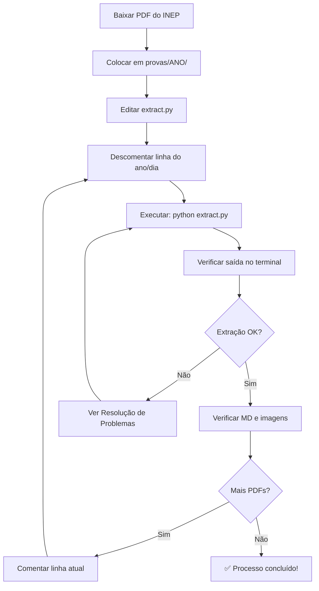

# 📚 Guia Completo: Extração de Provas do ENEM (1998-2025)

Este documento fornece um passo a passo detalhado para extrair texto e imagens de todas as provas do ENEM desde 1998 até 2025.

---

## 📋 Índice

1. [Visão Geral](#visão-geral)
2. [Pré-requisitos](#pré-requisitos)
3. [Estrutura de Pastas](#estrutura-de-pastas)
4. [Como Funciona o Script](#como-funciona-o-script)
5. [Passo a Passo de Extração](#passo-a-passo-de-extração)
6. [🔄 Conversão de Markdown para JSON](#-conversão-de-markdown-para-json)
7. [📸 Processo OCR para PDFs Escaneados](#-processo-ocr-para-pdfs-escaneados)
8. [Nomenclatura dos Arquivos](#nomenclatura-dos-arquivos)
9. [Verificação dos Resultados](#verificação-dos-resultados)
10. [Resolução de Problemas](#resolução-de-problemas)

---

## 🎯 Visão Geral

O processo de extração converte PDFs das provas do ENEM em:
- **Arquivos Markdown (.md)** contendo todo o texto das questões
- **Imagens PNG** extraídas dos PDFs (gráficos, tabelas, ilustrações)

**Importante:**
- De **2025 até 2009**: Cada ano tem **2 dias de prova** (Dia 1 e Dia 2)
- De **2008 até 1998**: Cada ano tem **1 dia de prova** apenas

---

## ⚙️ Pré-requisitos

### 1. Instalar Python 3.8+

Verifique se Python está instalado:
```bash
python --version
```

Se não estiver, baixe em: https://www.python.org/downloads/

### 2. Instalar a biblioteca pymupdf4llm

Execute no terminal:
```bash
pip install pymupdf4llm
```

### 3. Organizar os PDFs

Você precisará baixar os PDFs oficiais do ENEM do site do INEP:
- https://www.gov.br/inep/pt-br/areas-de-atuacao/avaliacao-e-exames-educacionais/enem/provas-e-gabaritos

---

## 📁 Estrutura de Pastas

Após a extração, as pastas ficarão organizadas assim:

```
extracoes-enem/
│
├── extract.py                    # Script de extração
│
├── provas/                       # PDFs originais (você coloca aqui)
│   ├── 2025/
│   │   ├── 2025_PV_impresso_D1_CD1.pdf
│   │   └── 2025_PV_impresso_D2_CD7.pdf
│   ├── 2024/
│   │   ├── 2024_PV_impresso_D1_CD1.pdf
│   │   └── 2024_PV_impresso_D2_CD7.pdf
│   ├── 2023/
│   │   ├── 2023_PV_impresso_D1_CD1.pdf
│   │   └── 2023_PV_impresso_D2_CD7.pdf
│   ├── ...
│   └── 1998/
│       └── 1998_PV_impresso.pdf
│
├── extracoes/                    # Markdowns gerados (saída)
│   ├── 2025/
│   │   ├── prova_enem_2025_D1_CD1.md
│   │   └── prova_enem_2025_D2_CD7.md
│   ├── 2024/
│   │   ├── prova_enem_2024_D1_CD1.md
│   │   └── prova_enem_2024_D2_CD7.md
│   └── ...
│
└── images/                       # Imagens extraídas (saída)
    ├── prova-2025/
    │   ├── 2025_PV_impresso_D1_CD1.pdf-0-0.png
    │   ├── 2025_PV_impresso_D1_CD1.pdf-1-1.png
    │   └── ...
    ├── prova-2024/
    └── ...
```

---

## 🔧 Como Funciona o Script

O arquivo `extract.py` contém a função principal:

```python
convert_to_markdown_with_images(pdf_path, output_path)
```

### Parâmetros:

1. **`pdf_path`**: Caminho relativo do PDF de entrada
   - Exemplo: `"provas/2025/2025_PV_impresso_D1_CD1.pdf"`

2. **`output_path`**: Nome do arquivo Markdown de saída
   - Exemplo: `"prova_enem_2025_D1_CD1.md"`

### O que o script faz:

1. Lê o PDF usando `pymupdf4llm`
2. Extrai todo o texto e converte para Markdown
3. Identifica e extrai todas as imagens como PNG
4. Organiza automaticamente em pastas por ano:
   - Markdown vai para `extracoes/{ANO}/`
   - Imagens vão para `images/prova-{ANO}/`

---

## 🚀 Passo a Passo de Extração

### Etapa 1: Preparar os PDFs

Para cada ano, baixe os PDFs oficiais e organize na pasta `provas/`:

```bash
# Exemplo para 2025 (2 dias)
extracoes-enem/provas/2025/2025_PV_impresso_D1_CD1.pdf
extracoes-enem/provas/2025/2025_PV_impresso_D2_CD7.pdf

# Exemplo para 2008 (1 dia apenas)
extracoes-enem/provas/2008/2008_PV_impresso.pdf
```

### Etapa 2: Editar o Script

Abra o arquivo `extract.py` e vá até o final (linha ~90)

**Para anos de 2009-2025 (2 dias de prova):**

Descomente e ajuste as duas linhas:

```python
# ANO 2025
convert_to_markdown_with_images("provas/2025/2025_PV_impresso_D1_CD1.pdf", "prova_enem_2025_D1_CD1.md")
convert_to_markdown_with_images("provas/2025/2025_PV_impresso_D2_CD7.pdf", "prova_enem_2025_D2_CD7.md")
```
a parte _D1_CD1 deve ser ajustada de acordo com o arquivo pdf da prova.

**Para anos de 1998-2008 (1 dia de prova):**

Use apenas uma linha:

```python
# ANO 2008
convert_to_markdown_with_images("provas/2008/2008_PV_impresso.pdf", "prova_enem_2008.md")
```

### Etapa 3: Executar o Script

No terminal, navegue até a pasta `extracoes-enem` e execute:

```bash
cd extracoes-enem
python extract.py
```

**Saída esperada:**

```
Extraindo texto e imagens de: /caminho/completo/provas/2025/2025_PV_impresso_D1_CD1.pdf...
Markdown salvo em: /caminho/completo/extracoes/2025/prova_enem_2025_D1_CD1.md
Imagens extraídas para a pasta: /caminho/completo/images/prova-2025
```

### Etapa 4: Verificar os Resultados

Após a execução, verifique:

✅ **Arquivo Markdown foi criado?**
```bash
ls extracoes/2025/
# Deve mostrar: prova_enem_2025_D1_CD1.md
```

✅ **Imagens foram extraídas?**
```bash
ls images/prova-2025/ | wc -l
# Deve mostrar a quantidade de imagens extraídas
```

### Etapa 5: Repetir para o Próximo PDF

Depois de verificar que tudo funcionou:

1. **Comente** a linha que acabou de executar
2. **Descomente** a próxima linha (próximo dia ou próximo ano)
3. Execute novamente: `python extract.py`

**Exemplo de progressão:**

```python
# ✅ JÁ EXECUTADO - comentar
# convert_to_markdown_with_images("provas/2025/2025_PV_impresso_D1_CD1.pdf", "prova_enem_2025_D1_CD1.md")

# ⏳ EXECUTAR AGORA - descomentar
convert_to_markdown_with_images("provas/2025/2025_PV_impresso_D2_CD7.pdf", "prova_enem_2025_D2_CD7.md")

# ⏸️ AGUARDANDO - manter comentado
# convert_to_markdown_with_images("provas/2024/2024_PV_impresso_D1_CD1.pdf", "prova_enem_2024_D1_CD1.md")
```

### Etapa 6: Processar Todos os Anos

Continue o processo para todos os anos:

**Anos com 2 dias (2009-2025):**
- 2025: Dia 1 + Dia 2
- 2024: Dia 1 + Dia 2
- 2023: Dia 1 + Dia 2
- ...
- 2009: Dia 1 + Dia 2

**Anos com 1 dia (1998-2008):**
- 2008: apenas 1 arquivo
- 2007: apenas 1 arquivo
- ...
- 1998: apenas 1 arquivo

---

## 📝 Nomenclatura dos Arquivos

### Padrão de Nomenclatura INEP

Os PDFs oficiais seguem este padrão:

```
{ANO}_PV_impresso_D{DIA}_CD{CADERNO}.pdf
```

**Exemplos:**
- `2025_PV_impresso_D1_CD1.pdf` → Dia 1, Caderno 1 (Azul)
- `2025_PV_impresso_D2_CD7.pdf` → Dia 2, Caderno 7 (Amarelo)

### Cores dos Cadernos (2009+)

O ENEM usa cadernos de diferentes cores com questões embaralhadas:

| Código | Cor      | Comum para         |
|--------|----------|--------------------|
| CD1    | Azul     | Dia 1 e Dia 2      |
| CD2    | Amarelo  | Dia 1 e Dia 2      |
| CD3    | Branco   | Dia 1 e Dia 2      |
| CD4    | Rosa     | Dia 1 e Dia 2      |
| CD5    | Cinza    | Dia 1              |
| CD6    | Laranja  | Dia 1              |
| CD7    | Amarelo  | Dia 2              |
| CD8    | Rosa     | Dia 2              |

**Dica:** Para simplificar, você pode escolher extrair apenas 1 caderno por dia (ex: sempre CD1 para Dia 1 e CD7 para Dia 2), já que todos os cadernos contêm as mesmas questões, apenas em ordens diferentes.

### Padrão de Saída

Nosso padrão de nomenclatura para os arquivos extraídos:

```
prova_enem_{ANO}_D{DIA}_CD{CADERNO}.md
```

**Exemplos:**
- `prova_enem_2025_D1_CD1.md`
- `prova_enem_2025_D2_CD7.md`
- `prova_enem_2008.md` (anos sem dia/caderno)

---

## ✅ Verificação dos Resultados

### Checklist Após Cada Extração

Para cada PDF processado, verifique:

#### 1. Arquivo Markdown foi criado

```bash
# Verificar se o arquivo existe
ls extracoes/2025/prova_enem_2025_D1_CD1.md

# Verificar tamanho do arquivo (deve ter alguns MB)
ls -lh extracoes/2025/prova_enem_2025_D1_CD1.md
```

**Tamanho esperado:** Entre 500 KB e 5 MB

#### 2. Conteúdo do Markdown está correto

Abra o arquivo e verifique:

```bash
# Ver as primeiras 50 linhas
head -50 extracoes/2025/prova_enem_2025_D1_CD1.md
```

**Deve conter:**
- ✅ Texto das questões
- ✅ Referências de imagens: ``
- ✅ Alternativas (A, B, C, D, E)

#### 3. Imagens foram extraídas

```bash
# Contar quantas imagens foram extraídas
ls images/prova-2025/*.png | wc -l

# Listar algumas imagens
ls images/prova-2025/ | head -10
```

**Quantidade esperada:** Varia por prova, geralmente entre 50-200 imagens

#### 4. Imagens estão legíveis

Abra algumas imagens para confirmar que foram extraídas corretamente:

```bash
# No Windows
start images/prova-2025/2025_PV_impresso_D1_CD1.pdf-0-0.png

# No Linux/Mac
xdg-open images/prova-2025/2025_PV_impresso_D1_CD1.pdf-0-0.png
```

---

## 🔍 Script de Verificação Automática

Para facilitar a verificação, você pode criar um script `verificar.py`:

```python
import pathlib

def verificar_extracao(ano, dia=None, caderno=None):
    """Verifica se a extração foi bem-sucedida"""

    base = pathlib.Path(__file__).parent

    # Determinar nome do arquivo
    if dia and caderno:
        md_name = f"prova_enem_{ano}_D{dia}_CD{caderno}.md"
        img_folder = f"prova-{ano}"
    else:
        md_name = f"prova_enem_{ano}.md"
        img_folder = f"prova-{ano}"

    # Verificar Markdown
    md_path = base / "extracoes" / str(ano) / md_name
    if not md_path.exists():
        print(f"❌ Markdown não encontrado: {md_path}")
        return False

    md_size = md_path.stat().st_size / 1024  # KB
    print(f"✅ Markdown encontrado: {md_name} ({md_size:.1f} KB)")

    # Verificar imagens
    img_path = base / "images" / img_folder
    if not img_path.exists():
        print(f"❌ Pasta de imagens não encontrada: {img_path}")
        return False

    images = list(img_path.glob("*.png"))
    print(f"✅ Imagens extraídas: {len(images)} arquivos")

    if md_size < 100:
        print("⚠️  ATENÇÃO: Arquivo Markdown muito pequeno!")

    if len(images) == 0:
        print("⚠️  ATENÇÃO: Nenhuma imagem foi extraída!")

    return True

# Exemplo de uso:
# verificar_extracao(2025, dia=1, caderno=1)
# verificar_extracao(2025, dia=2, caderno=7)
# verificar_extracao(2008)  # Para anos com 1 dia apenas
```

**Usar assim:**

```python
# No final do extract.py, após cada conversão:
convert_to_markdown_with_images("provas/2025/2025_PV_impresso_D1_CD1.pdf", "prova_enem_2025_D1_CD1.md")
verificar_extracao(2025, dia=1, caderno=1)  # <-- Adicionar verificação
```

---

## 🛠️ Resolução de Problemas

### Problema 1: `ModuleNotFoundError: No module named 'pymupdf4llm'`

**Solução:**
```bash
pip install pymupdf4llm
```

### Problema 2: PDF não encontrado

**Erro:**
```
FileNotFoundError: [Errno 2] No such file or directory: 'provas/2025/...'
```

**Solução:**
1. Verifique se o PDF está na pasta correta
2. Verifique se o nome do arquivo está correto (case-sensitive)
3. Use caminho absoluto se necessário

### Problema 3: Nenhuma imagem extraída

**Possíveis causas:**
- PDF contém poucas imagens (normal para algumas provas antigas)
- PDF está corrompido ou protegido

**Solução:**
- Abra o PDF manualmente e verifique se há imagens visíveis
- Tente baixar novamente o PDF do site oficial

### Problema 4: Markdown vazio ou muito pequeno

**Possíveis causas:**
- PDF está protegido contra extração de texto
- PDF é apenas imagem (scan)

**Solução:**
- Verifique se o PDF permite copiar texto (Ctrl+C)
- Se for scan, será necessário OCR (fora do escopo deste script)

### Problema 5: Caracteres estranhos no Markdown

**Exemplo:** `������` ou `???`

**Solução:**
- Normal para alguns caracteres especiais
- Será corrigido na etapa de conversão para JSON
- Não afeta a maioria do conteúdo

### Problema 6: Script muito lento

**Causas:**
- PDFs grandes (200+ páginas)
- Muitas imagens de alta resolução

**Solução:**
- É normal! Pode levar 2-5 minutos por PDF
- Aguarde a conclusão
- Não interrompa o processo

---

## 📊 Planilha de Controle (Template)

Crie uma planilha para controlar o progresso:

| Ano  | Dia | Caderno | PDF Baixado | Extração OK | MD Verificado | Imagens OK | Observações |
|------|-----|---------|-------------|-------------|---------------|------------|-------------|
| 2025 | 1   | CD1     | ✅          | ✅          | ✅            | ✅ (156)   | -           |
| 2025 | 2   | CD7     | ✅          | ✅          | ✅            | ✅ (142)   | -           |
| 2024 | 1   | CD1     | ✅          | ⏳          | ⏸️            | ⏸️         | Em processo |
| 2024 | 2   | CD7     | ✅          | ⏸️          | ⏸️            | ⏸️         | Aguardando  |
| ...  | ... | ...     | ...         | ...         | ...           | ...        | ...         |

---

## 🎯 Resumo do Fluxo Completo



---

## 📞 Suporte

Em caso de dúvidas:

1. Verifique a seção [Resolução de Problemas](#resolução-de-problemas)
2. Confira se seguiu todos os passos do [Passo a Passo](#passo-a-passo-de-extração)
3. Verifique se instalou corretamente o `pymupdf4llm`

---

## 📅 Checklist Final

Antes de considerar a extração completa, verifique:

- [ ] Todos os PDFs foram baixados (2009-2025: 2 dias cada / 1998-2008: 1 dia cada)
- [ ] Todos os arquivos MD foram gerados em `extracoes/`
- [ ] Todas as pastas de imagens foram criadas em `images/`
- [ ] Não há erros no terminal durante as execuções
- [ ] Arquivos MD têm tamanho razoável (> 100 KB cada)
- [ ] Imagens foram extraídas (verifique pelo menos 3 anos aleatórios)

---

## 🔄 Conversão de Markdown para JSON

Após extrair os markdowns, é necessário convertê-los para o formato JSON estruturado usado pelo projeto.

### Estrutura do JSON Final

O formato JSON segue esta estrutura:

```json
{
  "exam": {
    "id": "ENEM_2022_D1_AZUL",
    "year": 2022,
    "day": 1,
    "color": "AZUL",
    "area": "LINGUAGENS"
  },
  "questions": [
    {
      "id": "ENEM_2022_D1_LC_Q01",
      "number": 1,
      "examYear": 2022,
      "examDay": 1,
      "examColor": "AZUL",
      "area": "LINGUAGENS",
      "subject": "INGLES",
      "languageOption": "INGLES",
      "supportingMaterials": [
        {
          "id": "text_q01",
          "blocks": [
            {
              "id": "text_q01_1",
              "type": "paragraph",
              "content": "Texto de apoio da questão..."
            }
          ],
          "order": 1
        },
        {
          "id": "img_q01",
          "blocks": [
            {
              "id": "img_q01_1",
              "type": "image",
              "url": "/images/enem/2022/q01_img1.jpg",
              "alt": "Imagem da questão 1"
            }
          ],
          "order": 2
        }
      ],
      "statement": "Enunciado da questão...",
      "alternatives": {
        "A": "Alternativa A",
        "B": "Alternativa B",
        "C": "Alternativa C",
        "D": "Alternativa D",
        "E": "Alternativa E"
      },
      "correctAnswer": "D",
      "hasMultipleTexts": false,
      "hasImages": true
    }
  ]
}
```

### Scripts de Conversão

O projeto possui scripts automatizados para converter Markdown → JSON:

#### 1. Módulo de Limpeza de Encoding (`clean-encoding.ts`)

Corrige problemas comuns de encoding nos textos extraídos:
- Caracteres UTF-8 mal interpretados (ç → ç, ã → ã)
- Marcações markdown desnecessárias
- Normalização de espaços

#### 2. Parser de Markdown (`parse-enem-markdown.ts`)

Extrai estrutura das questões:
- Identifica blocos de questões pelo padrão `**QUESTÃO XX**`
- Extrai texto de apoio, enunciado e alternativas
- Detecta opção de língua estrangeira (Inglês/Espanhol)
- Mapeia imagens para URLs relativas

#### 3. Conversor em Lote (`convert-all-exams.ts`)

Script principal que processa múltiplos anos.

### Como Usar

#### Converter Anos Específicos

```bash
cd c:\Web Workspace\todas-do-enem-2.0

# Converter um ano específico
bun run convert-all-exams.ts 2022

# Converter múltiplos anos
bun run convert-all-exams.ts 2022 2023 2024

# Converter range de anos
bun run convert-all-exams.ts 2020-2025

# Converter todos os anos disponíveis
bun run convert-all-exams.ts all
```

#### Saída do Script

```
🚀 CONVERSÃO DE PROVAS ENEM PARA JSON
📊 Total de anos a processar: 2
📂 Saída: C:\Web Workspace\todas-do-enem-2.0\src\data
════════════════════════════════════════════════════════════

📅 ANO 2022
   Arquivos encontrados: 2
📖 Processando: 2022 - Dia 1 - AZUL
   DEBUG: 93 blocos de questão encontrados
   ✓ 72 questões extraídas
   ✅ enem-2022-d1-azul.json (72 questões)
📖 Processando: 2022 - Dia 2 - AZUL
   DEBUG: 90 blocos de questão encontrados
   ✓ 55 questões extraídas
   ✅ enem-2022-d2-azul.json (55 questões)

📅 ANO 2023
   Arquivos encontrados: 2
📖 Processando: 2023 - Dia 1 - AZUL
   ✓ 71 questões extraídas
   ✅ enem-2023-d1-azul.json (71 questões)
📖 Processando: 2023 - Dia 2 - AZUL
   ✓ 55 questões extraídas
   ✅ enem-2023-d2-azul.json (55 questões)

════════════════════════════════════════════════════════════
📈 RESUMO:
   ✅ Sucesso: 2 anos

✨ Conversão concluída!
```

### Estrutura de Saída

Os arquivos JSON são gerados em:

```
src/data/
├── 2022/
│   ├── enem-2022-d1-azul.json
│   └── enem-2022-d2-azul.json
├── 2023/
│   ├── enem-2023-d1-azul.json
│   └── enem-2023-d2-azul.json
└── ...
```

### Copiar Imagens para a Pasta Pública

Após a conversão, as imagens precisam ser copiadas para a pasta pública do projeto:

**Windows (PowerShell):**
```powershell
# Para um ano específico
robocopy "extracoes-enem\images\prova-2022" "public\images\enem\2022" *.png /E

# Para múltiplos anos (loop)
foreach ($year in 2022..2023) {
    robocopy "extracoes-enem\images\prova-$year" "public\images\enem\$year" *.png /E
}
```

**Linux/Mac:**
```bash
# Para um ano específico
cp -r extracoes-enem/images/prova-2022/* public/images/enem/2022/

# Para múltiplos anos
for year in {2022..2023}; do
    mkdir -p public/images/enem/$year
    cp -r extracoes-enem/images/prova-$year/* public/images/enem/$year/
done
```

### Renomear Imagens (Opcional)

As imagens extraídas têm nomes como `2022_PV_impresso_D1_CD1.pdf-1-0.png`.

O parser já converte as URLs no JSON para o formato `/images/enem/2022/q03_img1.jpg`, mas os arquivos físicos mantêm o nome original.

**Opção 1: Manter nomes originais**
- Ajustar o parser para usar os nomes originais nas URLs

**Opção 2: Renomear arquivos**
- Criar script de renomeação baseado nas referências do JSON

---

## 📸 Processo OCR para PDFs Escaneados

### O que é OCR?

**OCR (Optical Character Recognition)** é o processo de converter imagens de texto em texto editável/selecionável.

**Quando usar:**
- PDFs 100% escaneados (2006-2008)
- PDFs com qualidade ruim de texto (alguns anos 2009-2021)
- PDFs antigos onde o texto não é selecionável

### Passo a Passo Completo

#### 1️⃣ Instalar Tesseract OCR com Português

**Download e Instalação:**
```bash
# Windows: baixe o instalador
# https://digi.bib.uni-mannheim.de/tesseract/tesseract-ocr-w64-setup-5.3.3.20231005.exe

# Durante instalação:
# ✅ Marcar "Additional language data (download)"
# ✅ Selecionar "Portuguese" na lista
```

**OU instalar idioma manualmente:**

1. Baixe o pacote português:
   - Link: https://github.com/tesseract-ocr/tessdata/raw/main/por.traineddata
   - Tamanho: ~11 MB

2. Copie para a pasta de idiomas:
   ```
   C:\Program Files\Tesseract-OCR\tessdata\por.traineddata
   ```

**Verificar instalação:**
```bash
# Testar Tesseract
tesseract --version
tesseract --list-langs
# Deve mostrar: eng, osd, por

# Script de teste automático
python test-tesseract.py
```

**Saída esperada:**
```
✅ Tesseract encontrado! Versão: 5.x.x
✅ Idiomas instalados: eng, osd, por
✅ PORTUGUÊS (por) está instalado! 🎉
✅ TUDO OK! Você está pronto para executar os scripts de OCR!
```

#### 2️⃣ Processar Anos Escaneados (2006-2008)

```bash
cd extracoes-enem

# Processar automaticamente anos 2006, 2007, 2008
python ocr_extraction.py
```

**O que o script faz:**

1. ✅ Lê todas as imagens PNG de `images/prova-2006/`, `prova-2007/`, `prova-2008/`
2. ✅ Aplica OCR com Tesseract + idioma português em cada imagem
3. ✅ Limpa e organiza o texto extraído (remove espaços excessivos, normaliza)
4. ✅ Gera markdowns em `extracoes/2006/prova_enem_2006.md`, etc.
5. ✅ Mostra estatísticas (caracteres e palavras extraídas)

**Tempo estimado:** 15-30 minutos por ano (depende do número de páginas)

**Saída esperada:**
```
==================================================
[BOOK] Processando ano: 2006
==================================================
[+] Encontradas 45 imagens em images/prova-2006
  Processando imagem 1/45: 2006_amarela.pdf-0-0.png
  Processando imagem 2/45: 2006_amarela.pdf-1-0.png
  ...
[OK] Markdown salvo em: extracoes/2006/prova_enem_2006.md
[STATS] Estatisticas:
   - Caracteres: 142,583
   - Palavras: 18,245
```

#### 3️⃣ Converter Markdown OCR → JSON

```bash
cd ..  # volta para raiz do projeto

# Converter anos processados com OCR
bun run convert-all-exams.ts 2006 2007 2008
```

#### 4️⃣ Copiar Imagens para Public

```bash
# Copiar imagens dos anos OCR
bun run copy-images.ts 2006 2007 2008
```

#### 5️⃣ Validar e Revisar

**OCR não é perfeito!** Erros comuns:

- Confundir letras: `I` (i maiúsculo) com `l` (L minúsculo)
- Confundir `O` (letra O) com `0` (zero)
- Quebrar palavras: `ex tensão` em vez de `extensão`
- Adicionar espaços: `e m p r e s a` em vez de `empresa`

**Revisar:**
```bash
# Verificar markdown gerado
cat extracoes/2006/prova_enem_2006.md | head -200

# Verificar JSON gerado
cat src/data/2006/enem-2006-d1-*.json | jq '.questions[0]'
```

### Scripts Disponíveis

| Script | Uso | Quando usar |
|--------|-----|-------------|
| `test-tesseract.py` | Testa instalação | Antes de começar OCR |
| `ocr_extraction.py` | Processa anos 2006-2008 | PDFs 100% escaneados |
| `ocr-tesseract.py` | Processa 1 PDF específico | Reprocessar um ano |

### Troubleshooting OCR

**Erro: "Portuguese language not found"**
- Instale o pacote `por.traineddata` (veja passo 1)
- Guia completo: `INSTALL-TESSERACT.md`

**Erro: "pytesseract.TesseractNotFoundError"**
- Verifique se Tesseract está em `C:\Program Files\Tesseract-OCR\tesseract.exe`
- Adicione ao PATH se necessário

**Texto extraído tem muitos erros**
- Normal para PDFs muito antigos ou baixa resolução
- Considere revisar/corrigir manualmente no JSON
- Taxa de acerto esperada: 40-60% para PDFs escaneados

---

### Anos Suportados (Status Atual)

| Período | Status | Observações |
|---------|--------|-------------|
| 2022-2023 | ✅ Funcionando | Extração de texto e questões OK |
| 2009-2021 | ⚠️ Parcial | PDFs escaneados, muitas imagens |
| 2006-2008 | ❌ Problemático | PDFs 100% imagem, requer OCR |
| 2000-2005 | ⚠️ Parcial | Qualidade de OCR variável |
| 1998-1999 | ⚠️ Parcial | Formato antigo, requer ajustes |

#### 📖 Entendendo os Problemas por Tipo de PDF

##### ✅ PDFs Nativos (2022-2023)

**O que são:** PDFs gerados digitalmente, onde o texto é selecionável (você consegue copiar/colar).

**Como identificar:**
- Abra o PDF
- Tente selecionar texto com o mouse
- Se conseguir copiar texto → é PDF nativo ✅

**Resultado da extração:**
- ✅ Texto extraído com alta precisão
- ✅ Questões identificadas corretamente
- ✅ Alternativas capturadas
- ✅ Imagens separadas do texto

**Taxa de sucesso:** ~70% (72 de 93 questões no caso de 2022)

##### ⚠️ PDFs Híbridos (2009-2021)

**O que são:** PDFs que misturam texto selecionável com imagens escaneadas.

**Como identificar:**
- Parte do texto é selecionável
- Mas tabelas, gráficos e algumas seções são imagens
- Qualidade de texto varia por página

**Problemas na extração:**
- ⚠️ Texto parcialmente extraído
- ⚠️ Muitas questões viram imagens (sem texto)
- ⚠️ Markdown gerado tem muitas referências `` e pouco texto
- ⚠️ Alternativas podem estar em imagens

**Resultado esperado:**
- 0-30% das questões extraídas com sucesso
- Muitos blocos vazios ou só com imagens

**O que fazer:**
1. Verificar o markdown gerado manualmente
2. Se tem muitas imagens e pouco texto → usar OCR
3. Considerar extração manual das questões problemáticas

##### ❌ PDFs Escaneados 100% (2006-2008)

**O que são:** PDFs criados escaneando papel. Todo o conteúdo é imagem.

**Como identificar:**
- NÃO consegue selecionar nenhum texto
- Tudo é imagem (mesmo textos simples)
- Geralmente arquivos maiores (cada página é uma imagem grande)

**Problemas na extração:**
- ❌ Extração de texto retorna vazio ou caracteres aleatórios
- ❌ Parser não consegue identificar questões
- ❌ Resultado: 0 questões extraídas

**O que fazer:**

**Passo 1: Instalar Tesseract com Português**
```bash
# Veja guia completo em INSTALL-TESSERACT.md
# Resumo: baixar por.traineddata e copiar para C:\Program Files\Tesseract-OCR\tessdata\

# Testar instalação
python test-tesseract.py
```

**Passo 2: Aplicar OCR nas imagens**
```bash
# Processa anos 2006, 2007, 2008 automaticamente
python ocr_extraction.py
```

Isso vai:
- Ler todas as imagens PNG de `images/prova-2006/`, `prova-2007/`, `prova-2008/`
- Aplicar OCR com Tesseract + Português em cada imagem
- Gerar markdowns em `extracoes/2006/prova_enem_2006.md`, etc.

**Passo 3: Converter markdown → JSON**
```bash
cd ..  # volta para raiz do projeto
bun run convert-all-exams.ts 2006 2007 2008
```

**Passo 4: Copiar imagens**
```bash
bun run copy-images.ts 2006 2007 2008
```

**Passo 5: Revisar manualmente** (OCR pode ter erros)

**Taxa de sucesso com OCR:** 40-60% (depende da qualidade do scan)

##### ⚠️ PDFs Antigos com OCR (2000-2005)

**O que são:** PDFs antigos onde já foi aplicado OCR, mas a qualidade é ruim.

**Como identificar:**
- Consegue selecionar texto
- Mas há muitos caracteres estranhos: `������`, `îäå`, etc.
- Texto com erros de reconhecimento

**Problemas na extração:**
- ⚠️ Texto extraído com muitos erros
- ⚠️ Encoding problemático (já tentamos corrigir em `clean-encoding.ts`)
- ⚠️ Questões podem não ser identificadas pelo padrão

**Resultado esperado:**
- 10-40% das questões extraídas
- Textos precisam de muita limpeza manual

**O que fazer:**
1. Extrair normalmente
2. Revisar cada questão manualmente no JSON
3. Corrigir textos com erros de OCR
4. Considerar re-escanear com OCR moderno se tiver o PDF original

#### 🔬 Como Testar Seu PDF

Antes de extrair, teste seu PDF:

```bash
# 1. Tente selecionar texto no PDF
# Se não conseguir → é escaneado → precisa OCR

# 2. Extraia uma página de teste
python extract.py  # com apenas 1 PDF

# 3. Verifique o markdown gerado
cat extracoes/XXXX/prova_enem_XXXX.md | head -200

# 4. Analise:
# - Tem texto legível? → ✅ Nativo ou OCR bom
# - Só tem ? → ⚠️ Escaneado
# - Texto com ������? → ⚠️ OCR ruim
```

#### 💡 Dica: Identificar Tipo Antes de Processar Tudo

Recomendação: **Extraia e teste 1 ano primeiro** antes de processar todos os 27 anos.

**Ordem sugerida:**
1. Comece com 2023 (mais recente, maior chance de sucesso)
2. Se funcionar, faça 2022, 2021... retroativamente
3. Quando encontrar um ano com 0 questões, pause
4. Aplique OCR nesse ano específico
5. Continue para anos mais antigos

Isso economiza tempo e evita processar 20+ anos que precisarão de OCR depois.

### Problemas Conhecidos

#### 1. Questões Sem Alternativas Extraídas

**Sintoma:**
```
⚠️  Questão 5 (2022): não foi possível extrair alternativas
```

**Causas:**
- Alternativas em formato não padrão (tabelas, imagens)
- Texto de alternativa muito longo que quebra o padrão
- OCR ruim em PDFs escaneados

**Solução:**
- Revisar manualmente as questões com warning
- Ajustar o parser para padrões específicos

#### 2. Encoding com Problemas

**Sintoma:**
```json
"statement": "éroéorcionar encontros românticos"
```

**Causa:**
- Conversão incorreta de caracteres especiais

**Solução:**
- Ajustar mapeamentos em `clean-encoding.ts`
- Adicionar novos padrões de substituição

#### 3. Anos com 0 Questões Extraídas

**Sintoma:**
```
✓ 0 questões extraídas
```

**Causas:**
- PDF é 100% imagem (scan)
- Formato de questões diferente
- Problemas no padrão de split

**Solução:**
- Verificar o markdown extraído manualmente
- Aplicar OCR (usando `ocr_extraction.py`) se necessário
- Ajustar regex de detecção de questões

### Verificação dos JSONs

Após converter, verifique:

```bash
# Ver estrutura do JSON
cat src/data/2022/enem-2022-d1-azul.json | head -100

# Contar questões
cat src/data/2022/enem-2022-d1-azul.json | grep '"number":' | wc -l

# Verificar URLs de imagens
cat src/data/2022/enem-2022-d1-azul.json | grep '"url":' | head -10
```

### Próximos Passos

Após gerar os JSONs:

1. **Validar estrutura**: Conferir se JSON está no formato correto
2. **Copiar imagens**: Mover para `public/images/enem/`
3. **Adicionar gabaritos**: Atualmente todos estão como 'A'
4. **Importar para banco**: Usar scripts de seed do Prisma
5. **Testar no site**: Verificar renderização das questões

---

## 📊 Planilha de Controle (Template Atualizado)

| Ano  | Dia | PDF OK | MD OK | JSON OK | Imagens Copiadas | Gabarito | No Banco | Observações |
|------|-----|--------|-------|---------|------------------|----------|----------|-------------|
| 2023 | 1   | ✅     | ✅    | ✅      | ⏸️               | ⏸️       | ⏸️       | 71 questões |
| 2023 | 2   | ✅     | ✅    | ✅      | ⏸️               | ⏸️       | ⏸️       | 55 questões |
| 2022 | 1   | ✅     | ✅    | ✅      | ⏸️               | ⏸️       | ⏸️       | 72 questões |
| 2022 | 2   | ✅     | ✅    | ✅      | ⏸️               | ⏸️       | ⏸️       | 55 questões |
| 2021 | 1   | ✅     | ✅    | ❌      | ⏸️               | ⏸️       | ⏸️       | PDF scan    |
| ...  | ... | ...    | ...   | ...     | ...              | ...      | ...      | ...         |

---

**Última atualização:** 07/01/2026
**Versão:** 1.1
